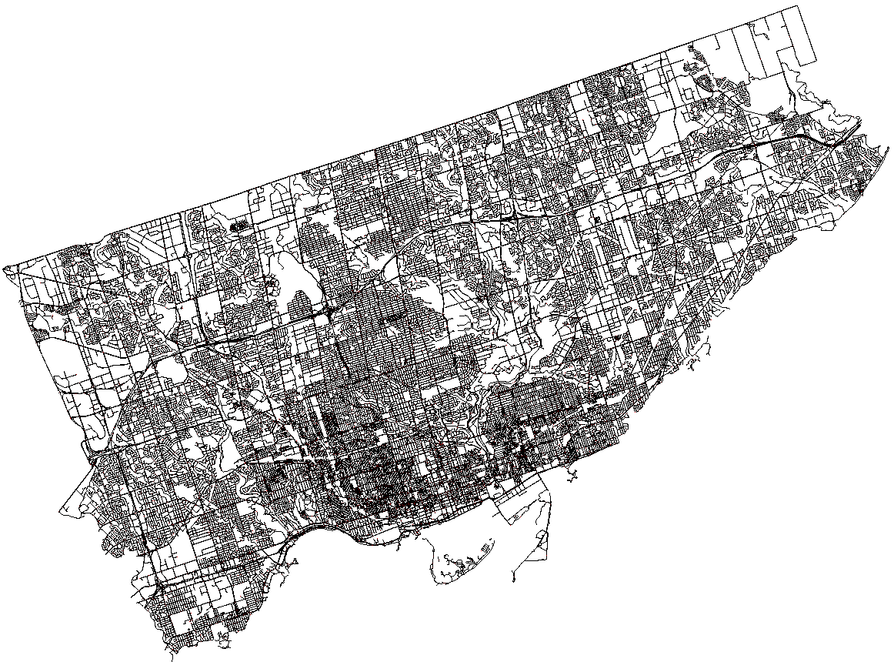
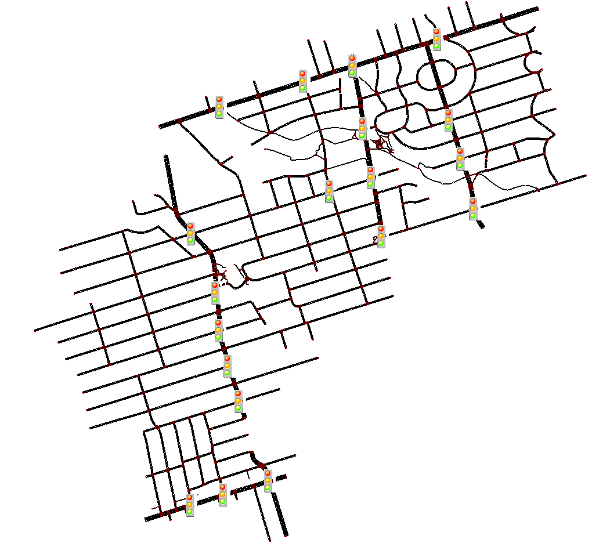

# TorontoSUMONetworks

## Introduction

TorontoSUMONetworks is an open-source project designed to facilitate the creation, manipulation, and simulation of traffic networks in Toronto using the Simulation of Urban MObility (SUMO) tool. This repository contains scripts and configurations that allow users to build realistic traffic simulation environments, manage traffic data, and analyze simulation outcomes, thereby supporting urban planning and traffic management initiatives. Traffic simulation is critical for urban planning as it enables city planners and engineers to predict and optimize traffic flow, evaluate infrastructure changes, and develop sustainable transportation solutions, ultimately improving the quality of life for city residents.

## Table of Contents

- [Installation](#installation)
- [Project Structure](#project-structure)
- [Usage](#usage)
- [Configurations](#configurations)
- [Contributing](#contributing)
- [License](#license)
- [Contact](#contact)

## Installation

### Prerequisites

Before installing TorontoSUMONetworks, ensure that you have the following software installed on your system:
- **Python 3.8+**
- **SUMO 1.8.0 or newer**

### To install SUMO on Linux:

To install SUMO on Ubuntu or Debian-based systems, run the following commands:
```bash
sudo add-apt-repository ppa:sumo/stable
sudo apt-get update
sudo apt-get install sumo sumo-tools sumo-doc
```
To install SUMO on Windows or macOS, please refer to the [SUMO website](https://sumo.dlr.de/docs/Installing/index.html) for detailed installation instructions.

### Step-by-step Installation Guide

1. **Clone the Repository**:
   ```bash
   git clone https://github.com/Jahandad-Baloch/TorontoSUMONetworks.git
   cd TorontoSUMONetworks
    ```

2. **Setup Virtual Environment (optional but recommended)**:
    ```bash
    python3 -m venv venv
    source venv/bin/activate # or venv\Scripts\activate on Windows
    ```

3. **Install Required Packages**:
    ```bash
    pip install -r requirements.txt
    ```

4. **Set Up SUMO Environment Variables**:
    - Add the SUMO_HOME to your system's PATH environment variable. For example, on Linux:
    ```bash
    export SUMO_HOME="/usr/share/sumo"
    export PATH="$PATH:$SUMO_HOME/bin"
    ```

5. **Run the Main Script**:
    ```bash
    python main.py --config configurations/main_config.yaml
    ```

## Project Structure

The project is structured as follows:

```
TorontoSUMONetworks/

├── configurations/                   # Configuration files for traffic networks
├── data/                             # Data files for traffic simulation
|   ├── raw/                          # Toronto transportation datasets
|   ├── processed/                    # Processed data for SUMO simulation
|   ├── sumo_networks/                # SUMO network files
|   ├── simulation_output/            # Output files from SUMO simulation
├── logs/                             # Log files for data processing and simulation
├── scripts/                          # Python scripts for data processing and simulation
|   ├── build_sumo_net/               # Scripts for building SUMO networks
|   ├── common/                       # Common utility scripts
|   ├── fetch_data/                   # Scripts for fetching Toronto transportation data
|   ├── results_analysis/             # Scripts for analyzing simulation results
|   ├── simulation/                   # Scripts for managing SUMO simulations
|   ├── traffic_data_processing/      # Scripts for processing traffic data
├── LICENSE                           # License file
├── main.py                           # Main script for running the project
├── README.md                         # Project README file
├── requirements.txt                  # Python package requirements
```

## Usage

### How to Run Simulations

1. **Set Up Your Configuration**:
    - Modify the configuration files in the `configurations/` directory to specify the network and simulation parameters.

2. **Run the Main Script**:
    ```bash
    python main.py --config configurations/main_config.yaml
    ```
    - This script will execute the SUMO simulation based on the specified configuration.

### Configurations
    - Each YAML configuration file in the configurations directory serves a specific purpose:
        - `main_config.yaml`: Contains the main configuration parameters for the SUMO simulation. User can specify the network, data, and simulation configurations.
        - `network_config.yaml`: Contains the network configuration parameters for building the SUMO network. User can build networks from scratch for the entire city, specific ward regions (any of the 25), or neighborhoods (any of the 158). The Toronto Centreline, Traffic Signal Locations, City Wards , and Neighborhoods datasets are used to build the network. User have the option to specify the types of lanes to include in the network, such as arterial, collector, and local roads.
        - `traffic_config.yaml`: Contains the traffic configuration parameters for generating traffic demand. User can specify the traffic demand for different vehicle types, such as passenger cars, trucks, buses, and bicycles. The traffic demand is generated for the specified network. The generated traffic demand is based on the City of Toronto Open Data, `Traffic Volumes at Intersections for All Modes` dataset. For public transportation, the `TTC Routes and Schedules` dataset in gtfs zip format is used to generate bus stops and routes.
        - `simulation_config.yaml`: Contains the simulation configuration parameters for the SUMO simulation. User can specify the simulation duration, time step, and output files. The simulation output files include the summary, queue etc.
        - `datasets_config.yaml`: Contains the dataset configuration parameters for downloading required transportation data.
        - `lanes_config.yaml`: Contains the lane configuration parameters for building the SUMO network. Types of lanes to include in the network, such as arterial, collector, and local roads based on the network type specified in the network configuration.
        - `paths_config.yaml`: Contains the path configuration parameters for the project directories.
        - `routing_config.yaml`: Contains the routing configuration parameters for the SUMO routing tools. User can specify the routing algorithm, vehicle counts etc.
        - `analysis_config.yaml`: Contains the analysis configuration parameters for analyzing the simulation results. User can specify the analysis parameters such as the output files to analyze, and the visualization options.

Example of `main_config.yaml`:
The following example shows the default configuration settings for the main configuration file:
Executing the steps in the following order:
1. Download the required datasets from the City of Toronto Open Data Portal.
2. Build the SUMO network based on the specified network area and type.
3. Process the traffic data to generate traffic demand for the specified network.
4. Generate routes for the vehicles in the network.
5. Compose the SUMO configuration file (`.sumocfg`) for the simulation.
6. Run the SUMO simulation.
7. Analyze the simulation results.
8. The network extent can be set to "city_wide", "by_ward_name", or "by_neighbourhood".

```yaml
execution_settings:
  fetch_data: true
  build_network: true
  process_traffic_data: true
  generate_routes: true
  compose_sumocfg: true
  run_simulation: true
  analyze_results: true
  network_extent: "by_neighbourhood" # options "city_wide", "by_ward_name", "by_neighbourhood"

```
Example of `network_config.yaml`:
Network configuration settings for building the SUMO network based on the specified network area and type. The network area can be the entire city, specific ward regions, or neighborhoods. The network type can be arterial. Setting collector will include arterial and collector lanes, local includes all types of lanes in the network. Custom lane selection is possible by configuring lanes_config.yaml
```yaml
network_settings:
  city_wide:
    network_area: "City of Toronto"
    network_type: "arterial" # "arterial", "collector", "local"

  by_ward_name:
    network_area: "Scarborough North" # options "Scarborough North", "Don Valley West", "Etobicoke North", "North York", "Toronto Centre" etc.
    network_type: "arterial" # "arterial", "collector", "local"

  by_neighbourhood:
    network_area: "Lawrence Park South" # options "North Toronto" "Casa Loma" "Danforth East York" "South Eglinton-Davisville" "Dovercourt Village" 'Junction-Wallace Emerson' etc.
    network_type: "arterial" # "arterial", "collector", "local"

```
Executing the main.py with these default settings will download the required datasets, build the SUMO network for "Lawrence Park South", define its traffic lights using traffic signals tabular dataset, process the traffic volume data and use the volume to generate routes, use the bus routes and schedule gtfs dataset to generate bus stops and bus routes, compose the SUMO configuration file, run the SUMO simulation with default tlLogic traffic light programs, save the simulation outputs and analyze the simulation results for the specified network area and type.

## Exploring the Network files

Arterial network for the entire city of Toronto:


The network files are saved in the `data/sumo_networks/` directory. The network files include the network file (.net.xml), the configuration file (.sumocfg), the route files (.rou.xml), bus stops and other files required for the SUMO simulation. Logs with timestamps are saved in the `logs/` directory. Processed data files are saved in the `data/processed/` directory. Simulation output files are saved in the `data/simulation_output/` directory.

The network files can be visualized using the SUMO netedit tool or the SUMO GUI. 

```bash
netedit -s data/sumo_networks/city_wide_network.net.xml
```

Example arterial network built for "Lawrence Park South" neighborhood:



## Upcoming Features

- [ ] Add support for generating traffic demand for bikes and pedestrians
- [ ] Real-time lane closure and traffic incident simulation
- [ ] Implement additional traffic simulation scenarios
- [ ] Implement Emergency Vehicle Routing
- [ ] X2X Communication
- [ ] Traffic Singal Light Programs used by the City of Toronto
- [ ] Implement additional routing algorithms for SUMO simulations

## Contributing

We welcome contributions to the TorontoSUMONetworks project! To contribute,

1. Fork the repository
2. Create a new branch (`git checkout -b feature/AwesomeFeature`)
3. Commit your changes (`git commit -am 'Add AwesomeFeature'`)
4. Push to the branch (`git push origin feature/AwesomeFeature`)
5. Create a new Pull Request

## License

This project is licensed under the MIT License. See the [LICENSE](LICENSE) file for more details.

## Contact

For questions or support, please contact the project maintainer:
- Jahandad Baloch (@Jahandad-Baloch) - jahandadbaloch@gmail.com
