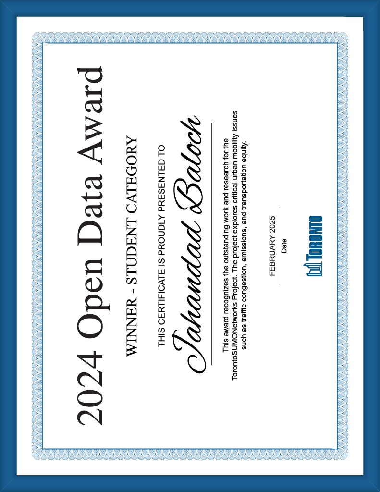
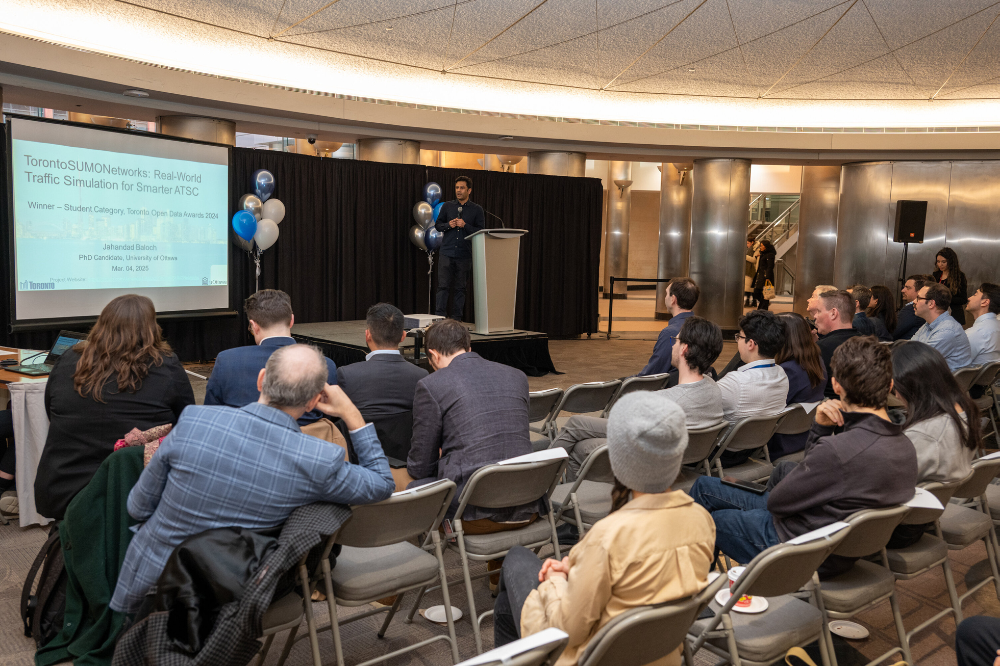

# TorontoSUMONetworks

[-FFD700?style=for-the-badge&logo=trophy&logoColor=black)](https://open.toronto.ca/announcing-the-2024-toronto-open-data-award-winners/)
[](LICENSE)
[](https://www.python.org/)
[](https://eclipse.dev/sumo/)

> 🏆 **Winner: 2024 Toronto Open Data Award (Student Category)**  
> Recognized by the City of Toronto for civic innovation and urban mobility simulation using municipal open datasets.  
> 🔗 **[Read the Official City of Toronto Announcement →](https://open.toronto.ca/announcing-the-2024-toronto-open-data-award-winners/)**

---

**TorontoSUMONetworks** is an open-source geospatial simulation framework built on top of [Eclipse SUMO (Simulation of Urban MObility)](https://eclipse.dev/sumo/). It provides an end-to-end pipeline to extract, transform, simulate, and analyze large-scale, multi-modal urban traffic networks using real-world municipal datasets. 

Whether evaluating adaptive traffic signal control (ATSC) through Multi-Agent Reinforcement Learning (MARL), routing algorithms, or network-level transit performance, TorontoSUMONetworks bridges the gap between raw open spatial data and production-grade traffic simulation.

---

## 🏆 Awards & Recognition

This framework was awarded the **2024 Toronto Open Data Award (Student Category)** by the City of Toronto, with official presentation at the Open Data Day celebration in **March 2025**.

* **Official Announcement:** [City of Toronto Open Data Winners](https://open.toronto.ca/announcing-the-2024-toronto-open-data-award-winners/)
* **Project Showcase:** Recognized for combining City of Toronto Centreline data, traffic volumes, and GTFS transit schedules to model large-scale urban infrastructure.

<p align="center">
  <!-- Place your certificate and event photo inside an /assets folder in your repo -->
  
  
</p>

---

## Table of Contents
1. [Key Features](#key-features)
2. [Data Integration & Geospatial Pipeline](#data-integration--geospatial-pipeline)
3. [Project Architecture](#project-architecture)
4. [Installation and Setup](#installation-and-setup)
5. [Configuration](#configuration)
6. [Usage](#usage)
7. [Simulation Workflow](#simulation-workflow)
8. [Troubleshooting](#troubleshooting)
9. [Contributing](#contributing)
10. [License](#license)
11. [Contact](#contact)

---

## Key Features

* **Real-World Civic Data Pipeline:** Automates ingestion and cleaning of OpenStreetMap (OSM) geometries, City of Toronto Centreline GeoJSONs, municipal boundaries, and official traffic volume records.
* **Multi-Modal Network Simulation:** Microscopic simulation of private passenger vehicles, public transit (bus and streetcar networks via GTFS integration), trucks, cyclists, and pedestrians.
* **Network-Scale Routing & Demand:** Integrated trip generation, origin-destination routing matrices, dynamic traffic assignment, and turn-movement ratio calculations.
* **Traffic Signal Control & MARL-Ready:** Supports Adaptive Traffic Signal Control (ATSC) and Multi-Agent Reinforcement Learning experiments with configurable E1/E2 loop detectors and TraCI API interfaces.
* **High Configurability:** Modular YAML-based pipeline controlling network boundaries (city-wide, ward-specific, or custom junction clusters), vehicle definitions, and output analytics.

---

## Data Integration & Geospatial Pipeline

TorontoSUMONetworks ingests and transforms several spatial layers:
* **Road Network Geometry:** City of Toronto Open Data Centreline GeoJSON & OpenStreetMap vector networks.
* **Administrative Boundaries:** Ward and neighborhood boundaries for localized bounding-box extractions.
* **Signal Timing & Detectors:** Municipal traffic signal program definitions converted to SUMO-compliant net configurations.
* **Public Transit:** GTFS (General Transit Feed Specification) schedule and shape data for surface transit modeling.

---

## Project Architecture

```plaintext
TorontoSUMONetworks/
├── assets/                    # Award certificates, diagrams, and project visuals
├── configurations/            # Modular YAML execution configs
│   ├── main_config.yaml       # Master execution pipeline
│   ├── network_config.yaml    # Boundary & network extent definitions
│   ├── traffic_config.yaml    # Demand & volume flow settings
│   ├── detectors_config.yaml  # E1/E2 loop detector placements
│   ├── routing_config.yaml    # Dynamic trip generation & turning weights
│   └── simulation_config.yaml # SUMO runtime parameters
├── data/
│   ├── raw/                   # Raw GeoJSON, GTFS, and CSV datasets
│   ├── processed/             # Cleaned spatial nodes, edges, and flow matrices
│   ├── simulation_output/     # Trajectory outputs, emissions, and queue data
│   └── sumo_networks/         # Generated .net.xml and route files
├── modules/
│   ├── core/                  # Core simulation orchestrator classes
│   ├── network/               # Centreline processor and SUMO netbuilder
│   ├── route/                 # Trips, routes, and GTFS import managers
│   ├── traffic/               # Traffic volume & turning movement integrators
│   └── common/                # XML generation, spatial transformations, utilities
├── main.py                    # Orchestration CLI entry point
├── requirements.txt           # Python environment dependencies
└── LICENSE                    # MIT License
```

---

## Installation and Setup

### Prerequisites
* **Python:** 3.8 or higher
* **Eclipse SUMO:** 1.9.0 or higher ([Installation Guide](https://eclipse.dev/sumo/))

### Step-by-Step Installation
1. **Clone the repository:**
   ```bash
   git clone https://github.com/Jahandad-Baloch/TorontoSUMONetworks.git
   cd TorontoSUMONetworks
   ```

2. **Set up a virtual environment:**
   ```bash
   python3 -m venv .venv
   source .venv/bin/activate  # Windows: .venv\Scripts\activate
   ```

3. **Install dependencies:**
   ```bash
   pip install -r requirements.txt
   ```

4. **Verify SUMO environment:**
   Ensure the `SUMO_HOME` variable is exported and points to your installation directory:
   ```bash
   export SUMO_HOME="/usr/share/sumo"  # Adjust to your SUMO path
   export PATH="$PATH:$SUMO_HOME/bin"
   sumo --version
   ```

---

## Configuration

Control the pipeline by editing files in `configurations/`:
* `main_config.yaml`: Toggle pipeline phases (`fetch_data`, `build_network`, `generate_routes`, `run_simulation`, `analyze_results`).
* `network_config.yaml`: Define target bounding extents (`city_wide`, `by_ward_name`, or target intersection clusters).
* `routing_config.yaml`: Set vehicle mix ratios, departure rates, and random trip parameters.

---

## Usage

Run the entire pipeline or specific stages using `main.py`:

```bash
# Execute standard pipeline configured via main_config.yaml
python main.py --config configurations/main_config.yaml
```

### Module Highlights
* **`TrafficNetworkCreation`** (`modules/network/`): Builds network topologies using `netconvert` from sanitized spatial data.
* **`CentrelineProcessor`** (`modules/network/`): Applies spatial clipping and lane categorization to City of Toronto GeoJSONs.
* **`TrafficDataIntegrator`** (`modules/traffic/`): Produces dynamic turning-ratio files and edge weight definitions.
* **`SumoRouteManager`** (`modules/route/`): Compiles multi-modal schedules and random trips into validated route XMLs.

---

## Contributing
Contributions and collaborative research initiatives are welcome. Please open an issue or submit a pull request.

## License
This project is open source and available under the [MIT License](LICENSE).

## Contact
**Jahandad Baloch**  
* Creator & Maintainer*  
* **GitHub:** [@Jahandad-Baloch](https://github.com/Jahandad-Baloch)  
* **LinkedIn:** [linkedin.com/in/jahandad-baloch](https://www.linkedin.com/in/jahandad-baloch)  
* **Email:** [jahandadbaloch@gmail.com](mailto:jahandadbaloch@gmail.com)
